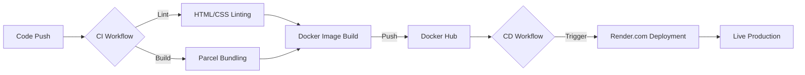

# 🎓 UCP DevOps Project

[](https://github.com/Asim12312/ucp-devops-project/actions/workflows/ci-development.yml)
[](https://opensource.org/licenses/ISC)
[](https://hub.docker.com/r/asim12312/ucp-devops-project)

> **A modern, high-performance web portal built with a cutting-edge DevOps mindset.**

This project showcases a complete software development lifecycle, from modern UI/UX design to a fully automated CI/CD pipeline using GitHub Actions, Docker, and Render.

---

## 🚀 Key Features

-   **✨ Modern UI/UX**: Responsive design with glassmorphism and vibrant aesthetics.
-   **🛠️ Tech Excellence**: Built using Parcel for lightning-fast bundling and minimal configuration.
-   **🐳 Containerization**: Fully dockerized application ensuring consistency across environments.
-   **🔄 Automated DevOps**: Robust CI/CD pipelines for staging, production, and development.
-   **⚡ High Performance**: Nginx-powered hosting with optimized caching strategies.

---

## 🛠️ Tech Stack

| Category | Technologies |
| :--- | :--- |
| **Frontend** |    |
| **Build Tool** |  |
| **DevOps** |    |
| **Standardization** |  |

---

## 🏗️ DevOps Pipeline Architecture

The project follows a rigorous automated pipeline to ensure code quality and seamless delivery.



---

## 🚦 Getting Started

### Prerequisites

-   [Node.js](https://nodejs.org/) (v20 or higher)
-   [Docker](https://www.docker.com/)

### Installation & Run

1.  **Clone the repository**
    ```bash
    git clone https://github.com/Asim12312/ucp-devops-project.git
    cd ucp-devops-project
    ```

2.  **Install dependencies**
    ```bash
    npm install
    ```

3.  **Run Development Build**
    ```bash
    npm run build
    ```

4.  **Linting**
    ```bash
    npm run lint
    ```

---

## 📄 License

Distributed under the ISC License. See `LICENSE` (if applicable) or `package.json` for more information.

---

## 👨‍💻 Team Members

**Muhammad Asim**
-   GitHub: [@Asim12312](https://github.com/Asim12312)
-   Project Link: [ucp-devops-project](https://github.com/Asim12312/ucp-devops-project)

**Sharjeel**
**Ahmad Hassan**
**Muhammad Yasir Raza**
---
<p align="center">Made with ❤️ for DevOps Excellence</p>
